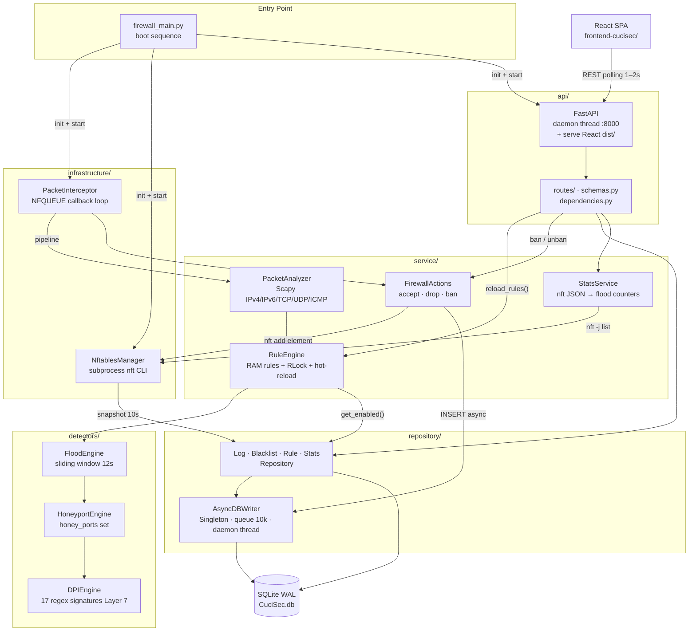
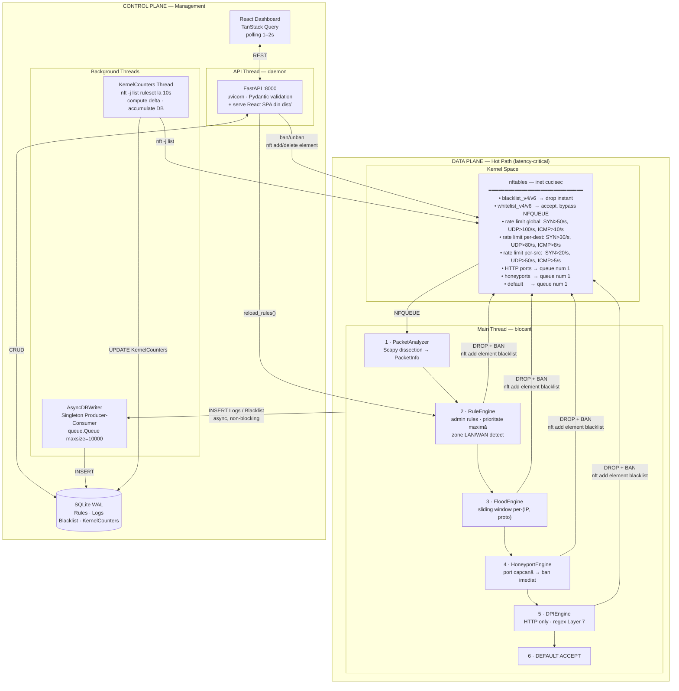
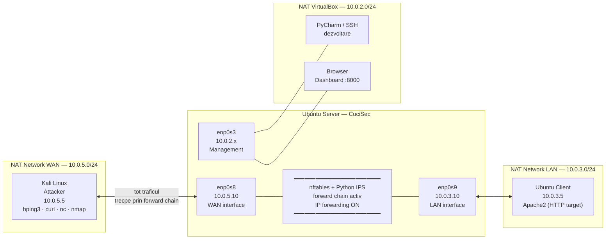
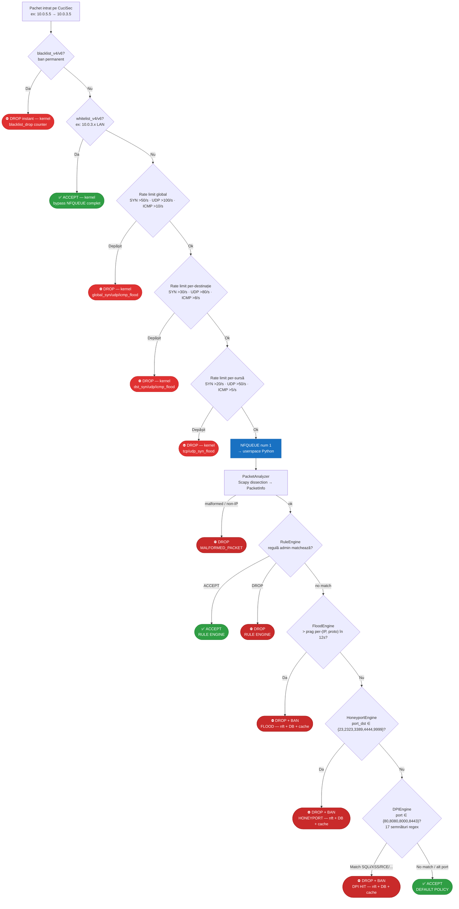
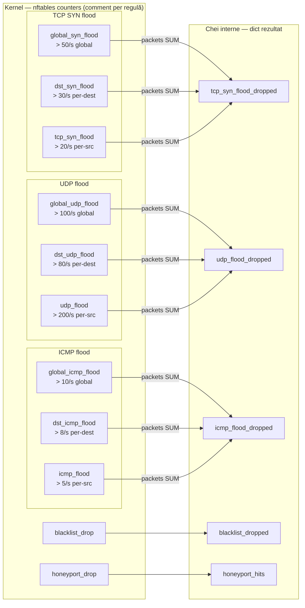
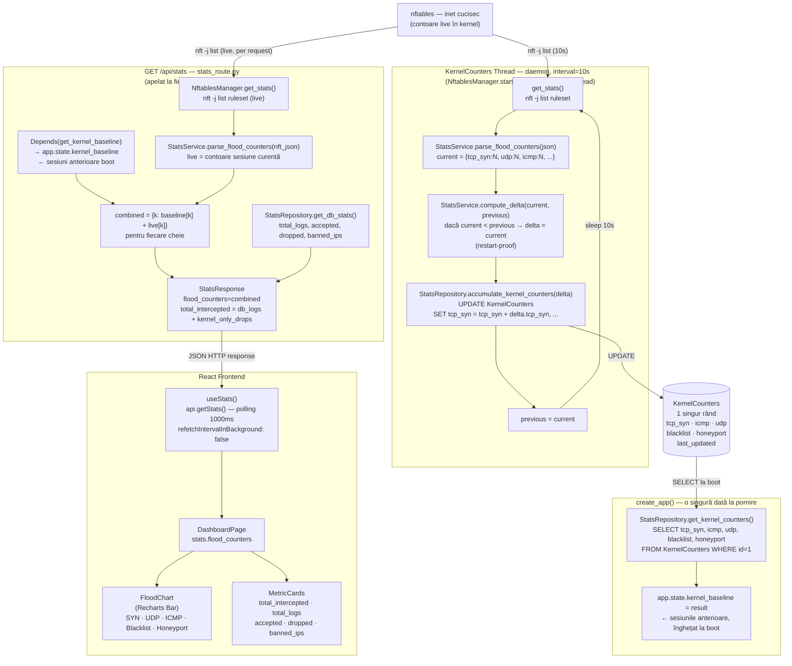

# CuciSec — Diagrame de arhitectură și testare

---

## 1. Arhitectura generală a codului

Relațiile dintre module și direcția fluxurilor principale.

---

## 2. Arhitectura Data Plane / Control Plane

Separarea clară între hot path (procesare pachete) și management.

---

## 3. Topologia VM pentru testare

### 3a. Rețeaua de test

### 3b. Fluxul decizional al unui pachet prin CuciSec

---

## 4. Fluxul statisticilor flood — de la kernel la frontend

Arată cum contraoarele nftables (global + per-dest + per-src) sunt agregate, persistate și combinate în răspunsul API.

### 4a. Agregarea counterelor nftables → chei interne

Fiecare protocol are **3 reguli nftables cu `counter`** (global / per-destinație / per-sursă). `parse_flood_counters()` le identifică după câmpul `comment` și le sumează într-un singur counter per protocol.

### 4b. Circuitul complet al statisticilor — de la nftables la FloodChart

**Observații cheie:**
- `kernel_baseline` este citit **o singură dată la boot** și nu se actualizează pe parcursul sesiunii. Reprezintă tot ce s-a acumulat în sesiunile anterioare.
- `live` reprezintă counterele nftables din **sesiunea curentă** (de la ultimul `nftables_setup.sh`).
- `combined = baseline + live` → totalul corect fără dublări.
- Thread-ul KernelCounters asigură că la **următorul boot**, `baseline` va include și sesiunea curentă.
- `compute_delta()` protejează împotriva valorilor negative dacă nftables este restartat în timpul unei sesiuni.

---

## Diagrame recomandate în plus

Acestea nu sunt incluse mai sus, dar ar fi utile pentru teză sau documentație:

| Diagramă | Tip Mermaid | Ce arată |
|---|---|---|
| **Thread model** | `graph LR` | Cele 4 thread-uri (main, API, AsyncDBWriter, KernelCounters) și ce partajează |
| **Secvența de boot** | `sequenceDiagram` | Ordinea exactă a inițializărilor: DB → nftables → sync blacklist → interceptor → API |
| **Flow-ul unui ban** | `sequenceDiagram` | Detector → FirewallActions → NftablesManager + AsyncDBWriter în paralel |
| **Schema DB** | `erDiagram` | Tabelele Rules/Logs/Blacklist/KernelCounters și câmpurile lor |
| **Componente frontend** | `graph TD` | Ierarhia React: pages → components → hooks → api/client.ts |
