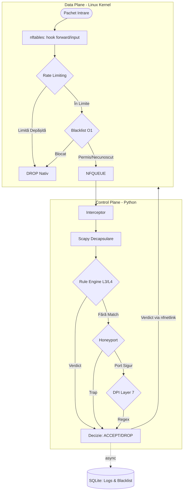

# CuciSec – Intrusion Prevention System & Firewall

[](LICENSE)
[](https://www.kernel.org/)
[](https://www.python.org/)
[](https://react.dev/)
[](#notă-academică)

> **CuciSec** este un sistem hibrid de tip Firewall și Intrusion Prevention System (IPS) (L3–L7). Proiectul face o punte între eficiența spațiului Kernel (rutare și limitare a ratei de pachete) și flexibilitatea spațiului Userspace (analiză profundă și euristică). 
> Lucrare de licență elaborată la Facultatea de Matematică și Informatică, Universitatea Babeș-Bolyai, Cluj-Napoca (2026).

---

## Cuprins

1. [Arhitectura Sistemului](#arhitectura-sistemului)
2. [Funcționalități Cheie](#funcționalități-cheie)
3. [Stiva Tehnologică](#stiva-tehnologică)
4. [Structura Proiectului](#structura-proiectului)
5. [Cerințe de Sistem](#cerințe-de-sistem)
6. [Instalare și Rulare](#instalare-și-rulare)
7. [API Reference](#api-reference)

---

## Arhitectura Sistemului

CuciSec implementează o arhitectură strictă **Data Plane / Control Plane**:

* **Data Plane (Kernel Space):** Utilizează `nftables` pentru a asigura limitarea de viteză direct la nivelul interfeței de rețea, respingând traficul de tip flood cu un overhead minim. Menține Blacklist folosind seturi hash-table pentru căutare în timp $O(1)$.
* **Control Plane (Userspace):** Pachetele legitime sau necunoscute sunt transferate din Kernel către Userspace prin mecanismul `NFQUEUE`. Aici, un motor Python procesează pachetele asincron, aplicând reguli statice (L3/L4), capcane (Honeyports) și analiză de conținut (L7 DPI).



---

## Funcționalități Cheie

* **Filtrare In-Memory L3/L4:** Reguli încărcate în RAM pentru latență zero. Suportă notare CIDR și zone-based filtering (LAN/WAN). Sistemul permite *Hot-Reload* (actualizarea regulilor prin API fără repornirea interceptorului).
* **Deep Packet Inspection (DPI):** Inspecție selectivă la nivelul 7 (Application Layer) utilizând expresii regulate pre-compilate pentru detectarea payload-urilor malițioase (ex: SQL Injection, XSS, RCE) în traficul HTTP necriptat.
* **Honeyport (Active Deception):** Expunerea deliberată a unor porturi capcană (ex: 23, 2323, 3389). Orice tentativă de conectare pe aceste porturi rezultă în banarea automată a adresei IP sursă.
* **Behavioral IPS:** Motor dedicat care analizează comportamentul pe o fereastră glisantă, corelând datele cu alertele `nftables` pentru a izola atacatorii persistenți.
* **Dashboard Real-Time:** Interfață web SPA pentru monitorizarea metricilor, gestionarea regulilor de firewall și auditarea jurnalelor (logs), cu smart polling asincron.

---

## Stiva Tehnologică

**Backend / Core Engine:**
* Python 3.10+
* NetfilterQueue (Wrapper C peste libnetfilter_queue)
* Scapy (Parsare pachete L3-L7)
* FastAPI & Uvicorn (API REST și gestiunea stării asincrone)
* SQLite (Mod WAL, citiri concurente, scrieri asincrone)

**Frontend:**
* React 19 + TypeScript + Vite
* Tailwind CSS v4 & shadcn/ui
* TanStack Query & Recharts

---

## Structura Proiectului

```plaintext
.
├── api/              # Rutele FastAPI (Rules, Logs, Blacklist, Stats)
├── database/         # Configurare SQLite, scheme și conexiuni
├── detectors/        # Logica de detecție: DPI, Flood, Honeyport
├── frontend-cucisec/ # Aplicația în React/Vite
├── infrastructure/   # Comunicarea cu Kernel-ul (NFQUEUE, nft_manager)
├── repository/       # Interacțiunea cu baza de date 
├── service/          # Logica de business (Rule Engine, Packet Analyzer)
├── utils/            # Setări de configurare și logging (Loguru)
└── firewall_main.py  # Entry-point-ul sistemului
```

---

## Cerințe de Sistem

* **Sistem de Operare:** Distribuție Linux (testat pe Ubuntu Server 22.04/24.04). Proiectul depinde de subsistemul **Netfilter**.
* **Privilegii:** Utilizator `root` (sau sudo) pentru crearea cozilor NFQUEUE și aplicarea regulilor nftables.
* **Node.js v18+** și `pnpm` (pentru frontend).

---

## Instalare și Rulare

### 1. Dependențe Kernel și OS
Se instalează utilitarele necesare pentru interacțiunea cu Netfilter:
```bash
sudo apt update
sudo apt install libnetfilter-queue-dev nftables iptables python3-venv
```

### 2. Configurare Backend (Python)
```bash
git clone https://github.com/EmiCuciu/CuciSec-Lucrare-de-licenta.git
cd CuciSec-Lucrare-de-licenta

# Creare mediu virtual
python3 -m venv venv
source venv/bin/activate

# Instalare dependențe
pip install -r requirements.txt

# Rulare (Necesită privilegii root)
sudo venv/bin/python firewall_main.py
```

### 3. Configurare Frontend (React)
Într-un terminal separat:
```bash
cd frontend-cucisec
pnpm install
pnpm run dev
```
* Dashboard: `http://localhost:5173`
* Documentație API: `http://localhost:8000/docs`

---

## API Reference (Sumar)


| Endpoint | Metodă | Rol |
| :--- | :--- | :--- |
| `/api/rules` | GET / POST | Listare / Adăugare regulă L3/L4 (Hot-Reload). |
| `/api/rules/{id}` | DELETE | Ștergere / Dezactivare regulă. |
| `/api/logs` | GET | Returnare jurnale paginate cu filtrare. |
| `/api/blacklist` | GET / POST | Interogare IP-uri banate / Banare manuală. |
| `/api/stats` | GET | Agregare metrici DB și contoare nftables. |

