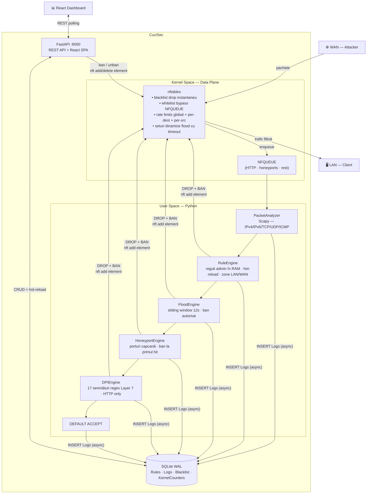

# CuciSec — Next Generation Firewall

[](https://www.python.org/)
[](https://react.dev/)
[](https://www.kernel.org/)
[](/z_Thesis/Lucrare_de_Licenta.pdf)

Sistem de detectie si prevenire a intruziunilor care combină filtrarea în kernel-space (nftables) cu inspecție deep-packet în userspace și un dashboard administrativ real-time.

---

## Arhitectura


```mermaid
flowchart TD
    WAN["🌐 WAN — Attacker"] -->|pachete| NF

    subgraph CuciSec["CuciSec"]
        subgraph KS["Kernel Space — Data Plane"]
            NF["nftables\n• blacklist drop instantaneu\n• whitelist bypass NFQUEUE\n• rate limits global + per-dest + per-src\n• seturi dinamice flood cu timeout"]
            NFQ["NFQUEUE\n(HTTP · honeyports · rest)"]
            NF -->|enqueue| NFQ
        end

        subgraph US["User Space — Python"]
            ANA["PacketAnalyzer\nScapy — IPv4/IPv6/TCP/UDP/ICMP"]
            RE["RuleEngine\nreguli admin în RAM · hot-reload · zone LAN/WAN"]
            FL["FloodEngine\nsliding window 12s · ban automat"]
            HP["HoneyportEngine\nporturi capcană · ban la primul hit"]
            DP["DPIEngine\n17 semnături regex Layer 7 · HTTP only"]
            DEF["DEFAULT ACCEPT"]

            NFQ --> ANA --> RE --> FL --> HP --> DP --> DEF
        end

        DB[("SQLite WAL\nRules · Logs · Blacklist · KernelCounters")]
        API["FastAPI :8000\nREST API + React SPA"]

        RE & FL & HP & DP -->|"DROP + BAN\nnft add element"| NF
        ANA & RE & FL & HP & DP & DEF -->|"INSERT Logs (async)"| DB
        API <-->|"CRUD + hot-reload"| DB
        API -->|"ban / unban\nnft add/delete element"| NF
    end

    NF -->|trafic filtrat| LAN["🖥️ LAN — Client"]
    DASH["📊 React Dashboard"] <-->|"REST polling"| API
```

---

## Stiva tehnologică

| Layer | Tehnologii |
|---|---|
| Kernel | nftables, NFQUEUE |
| Backend | Python 3.12, FastAPI, Scapy, NetfilterQueue, Loguru, SQLite WAL |
| Frontend | React 19, TypeScript, Vite, Tailwind CSS v4, shadcn/ui, TanStack Query, Recharts |

---

## Structura proiectului

```
firewall_main.py          — entry point, secvență de boot
scripts/nftables_setup.sh — inițializare ruleset kernel
api/                      — FastAPI: routes/, schemas.py, dependencies.py
database/                 — setup_db.py (WAL, CREATE TABLE, indexes)
detectors/                — dpi.py, flood.py, honeyport.py
domain/models.py          — dataclasses: PacketInfo, RuleModel, LogEntry
infrastructure/           — interceptor.py (NFQUEUE), nftables_manager.py
repository/               — AsyncDBWriter, Log/Rule/Blacklist/StatsRepository
service/                  — packet_analyzer.py, rule_engine.py, firewall_actions.py
utils/                    — config.py, logger.py
frontend-cucisec/         — React SPA
```

---

## Cerințe de sistem

- Linux (testat pe Ubuntu Server) — necesită subsistemul Netfilter
- Root / sudo — pentru NFQUEUE și nftables
- Python 3.12+, Node.js 18+, pnpm

---

## Instalare și rulare

**Dependențe OS:**
```bash
sudo apt install libnetfilter-queue-dev nftables python3-venv
```

**Backend:**
```bash
python3 -m venv venv
pip install -r requirements.txt
sudo venv/bin/python firewall_main.py
```

**Frontend (dev):**
```bash
cd frontend-cucisec && pnpm install && pnpm dev
# http://localhost:5173
```

**Frontend (producție)** — servit automat de FastAPI din `dist/`:
```bash
cd frontend-cucisec && pnpm build
# http://<IP>:8000
```

API docs: `http://localhost:8000/docs`

---

## API Reference

| Endpoint | Metodă | Rol |
|---|---|---|
| `/api/rules` | GET / POST | Listare / adăugare regulă + hot-reload |
| `/api/rules/{id}` | PUT / DELETE | Editare / ștergere + hot-reload |
| `/api/rules/{id}/toggle` | PATCH | Enable / disable regulă |
| `/api/logs` | GET | Loguri paginate cu filtre (protocol, action, IP) |
| `/api/logs/count` | GET | Count pe minut (ultimele 60 min) |
| `/api/blacklist` | GET / POST | IP-uri blocate / ban manual |
| `/api/blacklist/{ip}` | DELETE | Unban IP |
| `/api/stats` | GET | Statistici DB + counteri nftables |

---

Diagrame detaliate de arhitectură și testare în [`DIAGRAMS.md`](DIAGRAMS.md).
