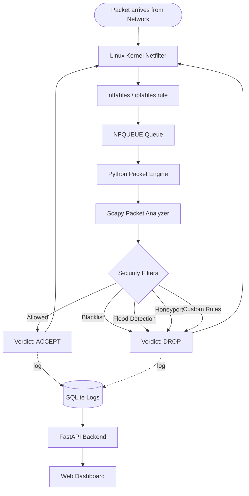

```mermaid
flowchart TD
    A([Packet arrives from Network])
    B[Linux Kernel Netfilter]
    C[nftables / iptables rule]
    D[NFQUEUE Queue]
    E[Python Packet Engine]
    F[Scapy Packet Analyzer]
    G{Security Filters}
    H[Verdict: ACCEPT]
    I[Verdict: DROP]
    J[(SQLite Logs)]
    K[FastAPI Backend]
    L[Web Dashboard]
    A --> B
    B --> C
    C --> D
    D --> E
    E --> F
    F --> G
    G -->|Blacklist| I
    G -->|Flood Detection| I
    G -->|Honeyport| I
    G -->|Custom Rules| I
    G -->|Allowed| H
    H --> B
    I --> B
    H -. log .-> J
    I -. log .-> J
    J --> K
    K --> L
```
