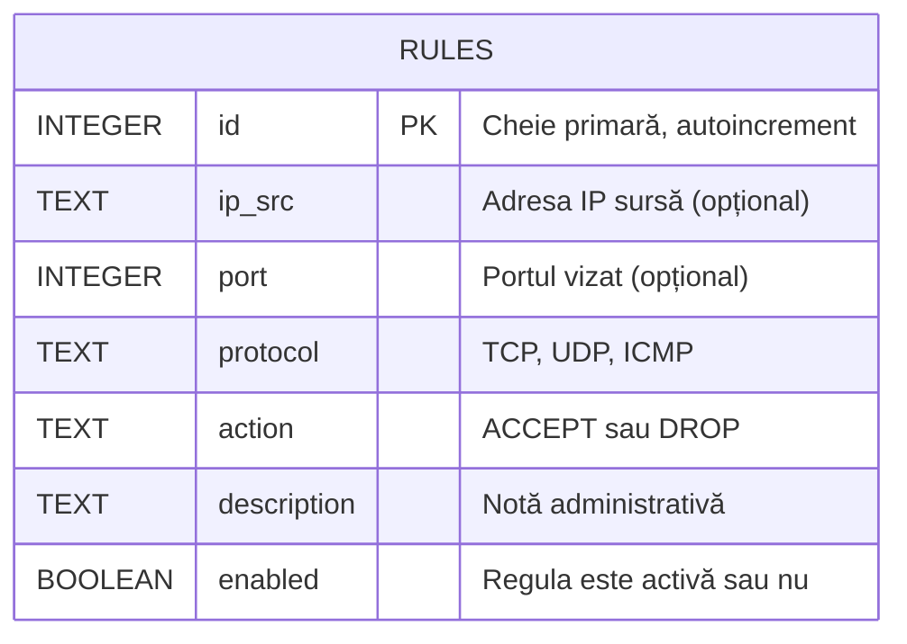
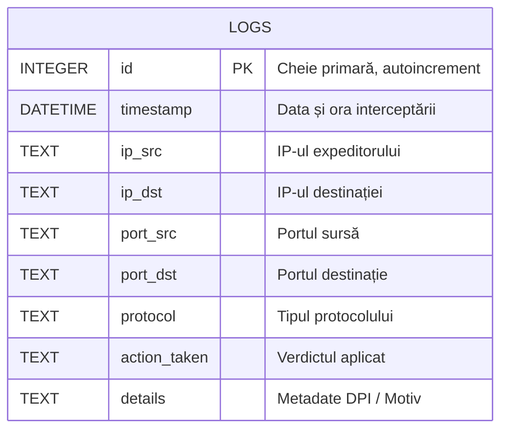
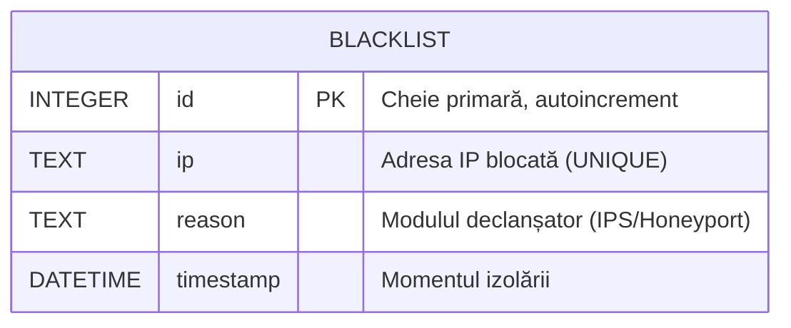

``` mermaid
erDiagram
    RULES {
        INTEGER id PK "Cheie primară, autoincrement"
        TEXT ip_src "Adresa IP sursă (opțional)"
        INTEGER port "Portul vizat (opțional)"
        TEXT protocol "TCP, UDP, ICMP"
        TEXT action "ACCEPT sau DROP"
        TEXT description "Notă administrativă"
        BOOLEAN enabled "Regula este activă sau nu"
    }
```

```mermaid
 erDiagram
    LOGS {
        INTEGER id PK "Cheie primară, autoincrement"
        DATETIME timestamp "Data și ora interceptării"
        TEXT ip_src "IP-ul expeditorului"
        TEXT ip_dst "IP-ul destinației"
        TEXT port_src "Portul sursă"
        TEXT port_dst "Portul destinație"
        TEXT protocol "Tipul protocolului"
        TEXT action_taken "Verdictul aplicat"
        TEXT details "Metadate DPI / Motiv"
    }

```

```mermaid
erDiagram
    BLACKLIST {
        INTEGER id PK "Cheie primară, autoincrement"
        TEXT ip "Adresa IP blocată (UNIQUE)"
        TEXT reason "Modulul declanșator (IPS/Honeyport)"
        DATETIME timestamp "Momentul izolării"
    }
```