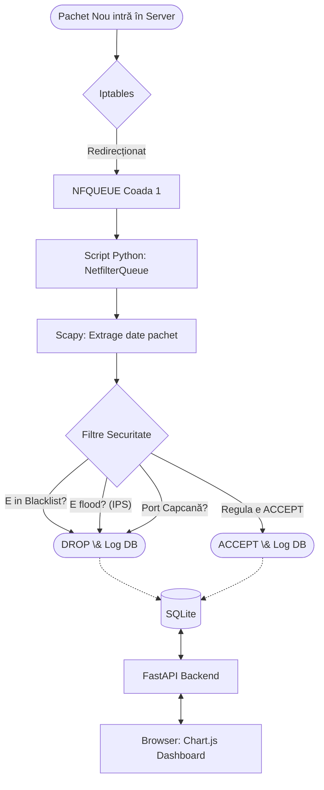

```mermaid
flowchart TD
    A([Pachet Nou intră în Server]) --> B{Iptables}
    B -- Redirecționat --> C[NFQUEUE Coada 1]
    C --> D[Script Python: NetfilterQueue]
    D --> E[Scapy: Extrage date pachet]

    E --> F{Filtre Securitate}
    F -- E in Blacklist? --> DROP([DROP \& Log DB])
    F -- E flood? (IPS) --> DROP
    F -- Port Capcană? --> DROP
    F -- Regula e ACCEPT --> ACCEPT([ACCEPT \& Log DB])

    DROP -.-> DB[(SQLite)]
    ACCEPT -.-> DB

    DB <--> API[FastAPI Backend]
    API <--> UI[Browser: Chart.js Dashboard]
```
