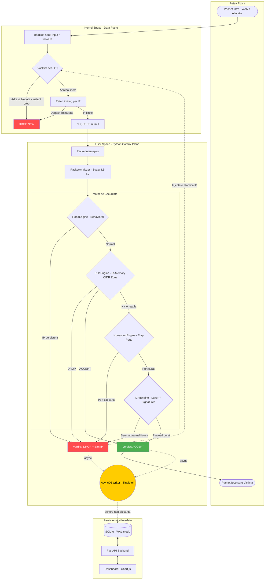

# CuciSec
## Sistem de Management si Interceptare a Traficului de Retea (Firewall)

Lucrare de licenta — Cuciurean Emilian-Petrut, Universitatea Babes-Bolyai Cluj-Napoca, Facultatea de Matematica si Informatica, 2026.

---

## Obiectiv

Dezvoltarea unui firewall software care depaseste limitarile sistemelor statice clasice, oferind:

- Interceptare pachete din Kernel-ul Linux via NFQUEUE
- Analiza inteligenta in Userspace (Python) cu logica de securitate multi-strat
- Inspecție la Level 7 (Deep Packet Inspection) pentru detectia atacurilor mascate
- Raspuns automat la amenintari fara interventie umana (IPS)
- Interfata web de administrare si monitorizare vizuala in timp real

---

## Arhitectura

Sistemul implementeaza o arhitectura hibrida **Data Plane / Control Plane**:

- **Data Plane (Kernel / nftables):** decizii instantanee, fara overhead. Blocheaza flood-ul la placa de retea, mentine blacklist-ul cu lookup O(1).
- **Control Plane (Userspace / Python):** analiza inteligenta, reguli complexe, DPI, zone-based filtering.

Structura interna respecta o arhitectura pe layere (domain, repository, service, infrastructure, api) cu separare stricta a responsabilitatilor.

---

## Tehnologii

**Kernel:**
- Ubuntu Server (virtualizat pe VirtualBox, portabil pe OpenWrt / Raspberry Pi)
- nftables pentru Data Plane (seturi hash-table O(1), rate limiting per-IP, dual-stack IPv4/IPv6)
- NFQUEUE pentru comunicarea Kernel <-> Userspace

**Userspace (Python 3):**
- Scapy pentru decapsulare pachete (Layer 3-7)
- NetfilterQueue (wrapper Python peste libnetfilter_queue)
- ipaddress (suport CIDR pentru zone-based filtering)
- threading (Producer-Consumer async logging, thread-safety FloodEngine)

**Date:**
- SQLite cu WAL mode (citiri concurente)
- Singleton AsyncDBWriter (o singura conexiune, scrieri non-blocante)

**API si UI:**
- FastAPI (ASGI, Pydantic validation, Dependency Injection, StaticFiles)
- Uvicorn
- HTML5, Bootstrap 5, Chart.js (in dezvoltare)
- Loguru (logging custom cu format per-nivel)

---

## Mecanisme de Securitate Implementate

**Filtrare Layer 3/4 (RuleEngine In-Memory):**
Reguli statice incarcate la boot in RAM. Suport CIDR (192.168.1.0/24). Zone-based filtering (LAN/WAN/GUEST). Hot-Reload prin API fara restart.

**Zone-Based Firewalling:**
Traficul LAN (interfata interna) este acceptat direct. Traficul WAN trece prin toata logica de securitate. Regulile pot fi etichetate cu zone pentru grupare logica (similar campus universitar cu zone admin/studenti/guest).

**Inspecție Selectiva Layer 7 (DPI Engine):**
Porturile de mare risc (HTTP/80, 8080) sunt trimise mereu in NFQUEUE indiferent de starea conexiunii — DPI vede fiecare pachet. SSH (22) beneficiaza de offloading in Kernel (payload criptat, DPI inutila). Detectie prin regex pre-compilate: SQL Injection, XSS, Path Traversal, RCE.

**Honeyport (Active Deception):**
Porturi capcana: 23 (Telnet), 2323 (Mirai), 3389 (RDP), 4444 (Metasploit), 9999. Orice conexiune -> ban instant. Atacatorul nu primeste "port inchis" — IP-ul lui este blocat 24h fara avertisment.

**IPS Hybrid (Kernel + Userspace FloodEngine):**
Kernel-ul limiteaza rata la 20 SYN/sec, 5 ICMP/sec, 200 UDP/sec — respinge bulk-ul atacului. FloodEngine in Python analizeaza comportamentul pe o fereastra glisanta de 12 secunde si baneaza definitiv atacatorii persistenti. Fereastra de 12 secunde este deliberata pentru observabilitate: graficul Dashboard afiseaza spike-ul inainte de ban.

**Blacklist Persistent cu Auto-Expiry:**
IP-urile blocate sunt stocate in DB (persistenta la restart) si in nftables (lookup O(1)). Expira automat dupa 24h din nftables (fara interventie cod). La restart, blacklist-ul este resincronizat din DB in Kernel inainte de a incepe interceptarea.

---

## Observabilitate

Fiecare regula de DROP din nftables include `counter`. Kernel-ul numara pachetele aruncate fara sa le trimita in Python.

`GET /api/stats` combina:
- Statistici din SQLite (loguri procesate in Python)
- Contoare din nftables via `nft -j list ruleset` (flood drops, blacklist drops, honeyport hits)
- Ultimele 5 ban-uri cu timestamp

Dashboard-ul face polling la 1-2 secunde, afisand spike-uri vizuale la atacuri.

---

## Structura Proiect

```
cucisec/
├── domain/
│   └── models.py               # PacketInfo, RuleModel, LogEntry, BlacklistEntry
├── repository/
│   ├── base.py                 # AsyncDBWriter Singleton
│   ├── rule_repository.py      # CRUD Rules
│   ├── log_repository.py       # INSERT + GET logs (paginate, filtrate, count by minute)
│   ├── blacklist_repository.py # INSERT/SELECT Blacklist
│   └── stats_repository.py     # DB statistics + recent bans
├── detectors/
│   ├── dpi.py                  # DPIEngine (regex signatures Layer 7)
│   ├── honeyport.py            # HoneyportEngine (trap ports)
│   └── flood.py                # FloodEngine (behavioral, sliding window, thread-safe)
├── service/
│   ├── packet_analyzer.py      # PacketAnalyzer (Scapy, IPv4/IPv6)
│   ├── rule_engine.py          # RuleEngine (in-memory, hot-reload, CIDR, zone)
│   ├── firewall_actions.py     # FirewallActions (verdict + async log + ban)
│   └── stats_service.py        # parsare JSON nftables counters
├── infrastructure/
│   ├── interceptor.py          # PacketInterceptor (NFQUEUE, graceful shutdown)
│   └── nftables_manager.py     # comenzi nft (ban, sync, setup, cleanup, get_stats)
├── api/
│   ├── api_main.py             # FastAPI factory (CORS, StaticFiles, app.state)
│   ├── dependencies.py         # Dependency Injection (get_rule_engine)
│   ├── schemas.py              # Pydantic schemas (validare + normalizare)
│   └── routes/
│       ├── rules_route.py      # CRUD /api/rules + Hot-Reload
│       ├── logs_route.py       # GET /api/logs + /api/logs/count
│       ├── blacklist_route.py  # GET/POST/DELETE /api/blacklist
│       └── stats_route.py      # GET /api/stats
├── database/
│   └── setup_db.py             # schema SQLite (WAL, indexuri)
├── scripts/
│   └── nftables_setup.sh       # configurare Kernel (hook input, pentru hook forward la Epic 6)
├── frontend/
│   └── index.html              # placeholder (Dashboard in dezvoltare)
├── utils/
│   ├── config.py               # Config centralizat
│   └── logger.py               # Loguru setup (format custom, fisier rotativ)
└── firewall_main.py            # Entry point (boot sequence, API thread, interceptor)
```

---

## Rulare

```bash
# Instalare dependente
pip install fastapi uvicorn netfilterqueue scapy loguru pydantic

# Pornire (necesita sudo pentru NFQUEUE si nftables)
sudo venv/bin/python3 firewall_main.py

# Acces
# Dashboard: http://localhost:8000/
# API Docs:  http://localhost:8000/docs
# API Root:  http://localhost:8000/api
```

---

## Mediu de Testare (Configuratie Curenta — Host IPS)

Configuratia curenta intercepteaza traficul destinat firewall-ului insusi (`hook input`). Adecvat pentru teste locale.

**VM 1 (Firewall — Ubuntu Server):** aplicatia centrala.

---

## Mediu de Testare (Configuratie Finala — Network IPS, Epic 6)

Topologia cu 3 masini virtuale simuleaza un scenariu real de productie. Firewall-ul devine "podul" dintre atacator si victima.

**VM 1 (Firewall — Ubuntu Server):**
- Adapter 1: NAT Network (WAN — zona atacatorului)
- Adapter 2: Internal Network "LAN_Victima" (LAN — zona protejata)
- Modificari necesare: `hook forward` in nftables, activare IP forwarding

**VM 2 (Atacator — Kali Linux):**
- Adapter 1: NAT Network (aceeasi retea cu Adapter 1 al firewall-ului)
- Unelte: nmap (scanare porturi, test honeyport), hping3 (flood test), curl (test DPI)

**VM 3 (Victima — Ubuntu Desktop):**
- Adapter 1: Internal Network "LAN_Victima"
- Conectata DOAR prin firewall, fara internet direct

---

## Diagrama de Functionare



---

## API Reference

| Endpoint | Metoda | Descriere |
|---|---|---|
| `/api/rules` | GET | Lista toate regulile |
| `/api/rules` | POST | Adauga regula + Hot-Reload automat |
| `/api/rules/{id}` | DELETE | Sterge regula + Hot-Reload |
| `/api/rules/{id}/toggle` | PATCH | Activeaza/dezactiveaza regula |
| `/api/logs` | GET | Logs paginate cu filtre (protocol, action, ip_src) |
| `/api/logs/count` | GET | Numarul de logs pe minute (pentru graficul live) |
| `/api/blacklist` | GET | Lista IP-uri blocate |
| `/api/blacklist` | POST | Ban manual |
| `/api/blacklist/{ip}` | DELETE | Unban manual |
| `/api/stats` | GET | Statistici DB + contoare nftables Kernel + recent bans |
| `/docs` | GET | Swagger UI auto-generat |
| `/` | GET | Dashboard HTML |

---

## Elemente de Inovatie

**Inspecție Selectiva (Selective DPI):** Spre deosebire de firewall-urile Stateful care aplica `established accept` global, CuciSec trimite porturile de mare risc mereu in NFQUEUE — DPI vede fiecare pachet HTTP indiferent de starea conexiunii, prevenind SQLi injectat pe conexiuni deja stabilite.

**Observabilitate prin contoare Kernel:** Flood-ul este oprit in Kernel (fara overhead Python), dar contoarele nftables sunt citite asincron de API si afisate pe grafic. Spike-ul vizual demonstraza amploarea atacului fara ca Python-ul sa fie suprasolicitat.

**Fereastra de 12 secunde (Behavioral IPS):** Banul definitiv este intarziat deliberat pentru a permite graficului sa afiseze evolutia atacului — echilibru intre securitate si observabilitate.

**Zone-Based Filtering cu CIDR:** Reguli pe subnets (192.168.50.0/24) cu etichete de zona, similar firewall-urilor enterprise (Cisco ASA, Palo Alto).

**Arhitectura zero-downtime:** Hot-Reload al regulilor fara restart, graceful shutdown cu cleanup Kernel, blacklist persistent la repornire.
